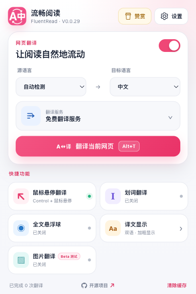
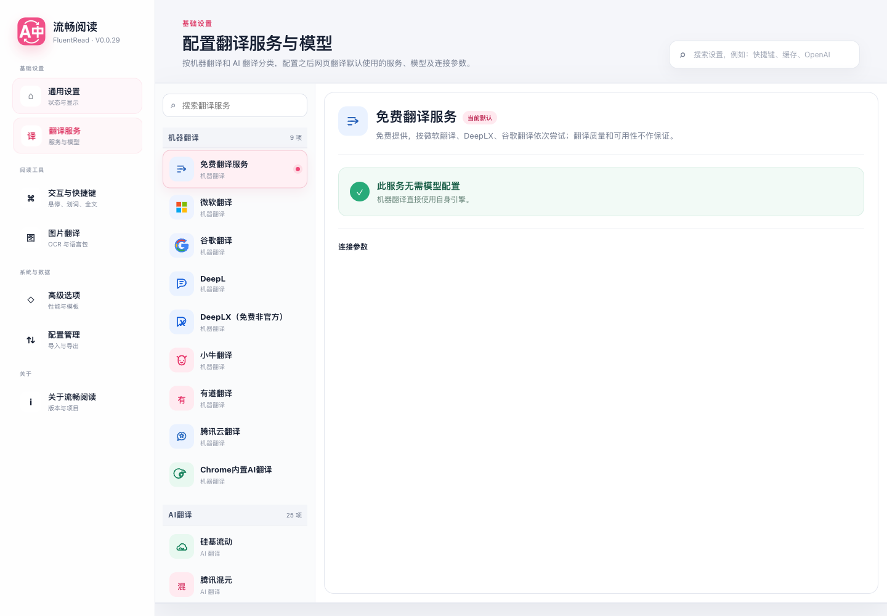

<div align="center">


# FluentRead

### Make every webpage feel native to read.

An open-source browser extension for bilingual webpages, instant selection translation, and flexible translation services.

[](https://github.com/FluentRead/FluentRead/releases)
[](./LICENSE)
[](https://github.com/FluentRead/FluentRead)

<br />

**[Install](#install)** · **[Explore features](#what-you-can-do)** · **[Read the docs](https://fluent.thinkstu.com/)** · **[简体中文](./misc/README_ZH.md)**

</div>

<p align="center">
  
</p>

FluentRead brings translation into the reading flow. Keep the original text beside the translation, translate only the sentence you need, or translate the whole page without opening another tab. Choose a traditional translation engine, an AI provider, or the built-in free fallback, then tune the experience to your reading habits.

## What you can do

| Read naturally | Stay in control |
| --- | --- |
| **Bilingual pages** — Keep original text and translation together for study, research, and technical reading. | **Many translation services** — Use Microsoft Translator, Google Translate, DeepL, DeepLX, Chrome Translator, or AI providers such as OpenAI, DeepSeek, Gemini, Claude, Kimi, Ollama-compatible endpoints, and more. |
| **Whole-page translation** — Use the floating ball, context menu, or a customizable shortcut. In Settings, choose progressive translation or translate all currently loaded content to the page bottom. | **Custom models and endpoints** — Configure compatible APIs, models, prompts, request bodies, proxies, and credentials from the settings page. |
| **Selection translation** — Select text and get a focused translation card with copy and speech actions. | **Privacy controls** — Preferences and cache stay in extension-private storage. API credentials are session-only by default; cloud translation sends text to the selected provider. |
| **Hover and gesture triggers** — Translate with a hover shortcut, double click, long press, middle click, or touch gestures. | **Reader-friendly controls** — Choose translation styles, themes, animation, cache behavior, concurrency, and separate shortcuts for page and selection translation. |

### Also included

- **Free Translation**: a built-in fallback chain that tries Microsoft first, then DeepLX, then Google when a service returns an error or empty result.
- **Image translation (Beta)**: local OCR for text in images, with downloadable language packs and a reversible translated overlay.
- **Translation cache**: reuse recent results for the same service, model, language pair, and request settings.
- **Explicit data handling**: review what each feature sends and stores in the [data and privacy guide](https://fluent.thinkstu.com/guide/privacy).
- **Cross-browser support**: WXT build targets for Chromium browsers (Manifest V3) and Firefox (Manifest V2).

## See it in action

### A small popup for everyday reading

The popup keeps the most-used controls close: enable or pause the extension, choose languages and a default service, open the full settings page, and clear the local translation cache.

<p align="center">
  
</p>

### Settings that scale with your workflow

Use focused settings pages for reading preferences, services and models, shortcuts, image translation, advanced behavior, and configuration backup.

<p align="center">
  
</p>

<p align="center">
  
</p>

## Install

| Browser | Store |
| --- | --- |
| Chrome | [Chrome Web Store](https://chromewebstore.google.com/detail/%E6%B5%81%E7%95%85%E9%98%85%E8%AF%BB/djnlaiohfaaifbibleebjggkghlmcpcj?hl=en) · [CrxSoso mirror](https://www.crxsoso.com/webstore/detail/djnlaiohfaaifbibleebjggkghlmcpcj) |
| Edge | [Microsoft Edge Add-ons](https://microsoftedge.microsoft.com/addons/detail/%E6%B5%81%E7%95%85%E9%98%85%E8%AF%BB/kakgmllfpjldjhcnkghpplmlbnmcoflp) |
| Firefox | [Firefox Add-ons](https://addons.mozilla.org/en-US/firefox/addon/%E6%B5%81%E7%95%85%E9%98%85%E8%AF%BB/) |

For a local build, install dependencies with pnpm and load the generated `./.output/chrome-mv3` directory as an unpacked extension. See the [official documentation](https://fluent.thinkstu.com/) for setup and configuration details.

An experimental userscript target for Via, Tampermonkey, and Violentmonkey can be generated with `pnpm build:userscript`. It produces the self-contained `./.output/userscript/fluent-read.user.js`; see the [userscript build guide](./docs/guide/userscript.md) for the supported feature matrix and browser-extension-only limitations.

## Documentation and community

- [Official documentation](https://fluent.thinkstu.com/) — features, setup, services, shortcuts, and FAQ.
- [GitHub Discussions and Issues](https://github.com/FluentRead/FluentRead/issues) — report a problem or suggest an improvement.
- [Bilibili introduction](https://www.bilibili.com/video/BV1ux4y1e73x/)
- [DeepWiki architecture overview](https://deepwiki.com/FluentRead/FluentRead)

## Development

```bash
pnpm install
pnpm dev
pnpm test:audit
pnpm test:unit
pnpm test:functional
pnpm test:regression
pnpm test:coverage
pnpm compile
pnpm build
pnpm build:userscript
```

Run `pnpm test:regression:all` for the deterministic one-command regression pipeline (test audit, all grouped tests, strict coverage, cross-browser/userscript builds, and docs). Isolated browser and live-network layers are explicit gates; see the [architecture](./docs/architecture.md) and [testing guide](./docs/testing.md) before contributing a feature.

FluentRead uses Vue 3, TypeScript, Element Plus, and WXT, targeting Chromium Manifest V3 and Firefox Manifest V2. The project is licensed under [GPL-3.0](./LICENSE).

## Star history

[](https://star-history.dera.page/#FluentRead/FluentRead&Date)
